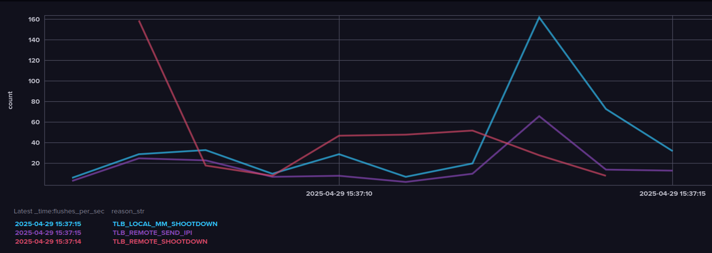

# Trace TLB flushes and view data in InfluxDB

Start the InfluxDB and Telegraf client:

```sh
make up # Start a docker container with InfluxDB and Telegraf
```

To stop the containers, run:

```sh
make stop # Stop the docker containers
```

Run the bpf tracer:

```sh
chmod +x ./trace_tlb_flush.py
sudo ./trace_tlb_flush.py
```

## Access InfluxDB

Access the InfluxDB web interface at `http://localhost:8086` and query the data with the query in `query.sql`. Use `Band` to show the data in a graph. Make sure to turn off `View Raw Data` to see the graph and make the y-axis the number of flushes.

The query will show:

> For every second in the dashboard’s time range, how many TLB-flushes happened on CPU 0 in the process code, broken down by each human-readable flush reason (reason_str).

## Result

The result should look like this:


We can see that there is a correlation between `TLB_REMOTE_SEND_IPI` and `TLB_LOCAL_MM_SHOOTDOWN` from the graph.
